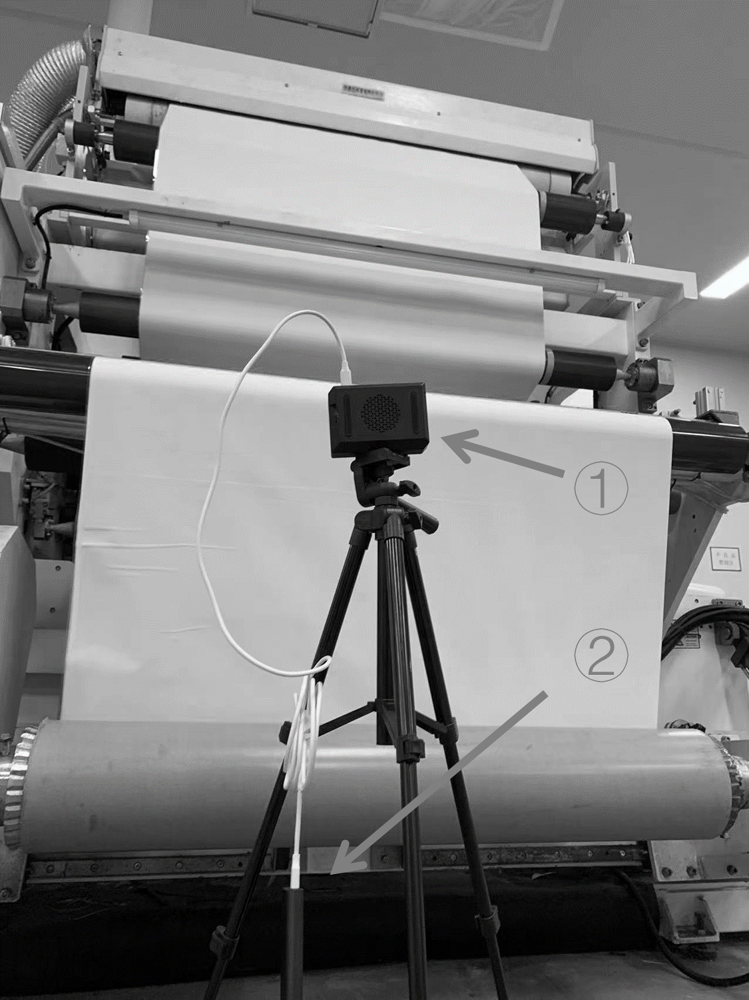
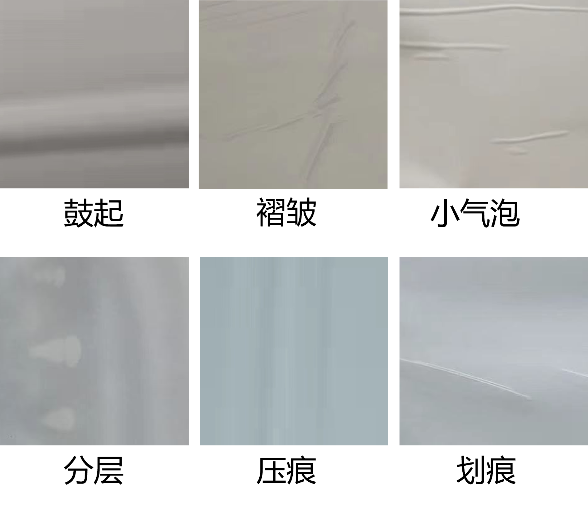

## 一种基于深度学习的太阳能封装膜缺陷检测系统
本发明公开一种基于便携式RGB摄像头的太阳能封装膜不良品检测方法与系统。其中便携式RGB摄像头包括笔记本电脑的摄像头、台式机外接摄像头、智能手机、平板电脑、树莓派等设备。系统包括，网络存储设备、网络型号发出设备、神经网络训练设备、便携式数据收集设备。该发明涉及图像处理领域、机器学习领域、电子检测领域。本发明针对太阳能电池封装膜不良品检测、具有低成本，可拓展，硬件设备要求低，可识别不同种类不良品的优势。

\
这是检测实例，①为树莓派4B。②为便携式电源。树莓派通过无线网络与互联网连接。

\
虽然现在的工业标准化已经非常成熟，但在工厂的温度、湿度、原料质量、压力、设备状态、设备自身震动等各种外界因素的印影响下，工业自动化生产中不可避免的会出现缺陷。缺陷检测一般是指对产品表面的斑点、划痕、色差、缺损等不良问题的检测，是工业质检的最重要的任务之一。工业生产的效率随着更多的自动化设备的使用不断提高，传统的人工检测速度慢、效率低、易出错，新员工培训成本高等问题逐渐变得不能忽视

\
这是其中一种训练结果，上图为准确度，下图为损失。评价、训练样本分别为200张、500张。

[back](../../)
