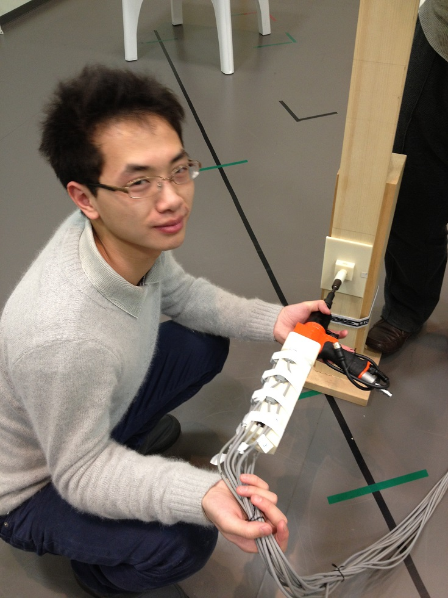

## 运用动作捕捉技术减少汽车组装时人工错误的技术
丰田的项目（旧关东自动车）
将电磁式动作捕捉安装在电钻上，用于记录工作人员是否将面板上所有螺丝拧上。
详细的技术记载https://astamuse.com/ja/published/JP/No/2013250176

\
这是当年我做实验的时候的照片，正在模拟现场的安装。
我主要负责做实验和实验数据的解析。

[back](../../)
